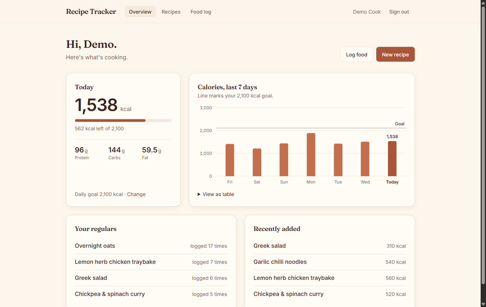
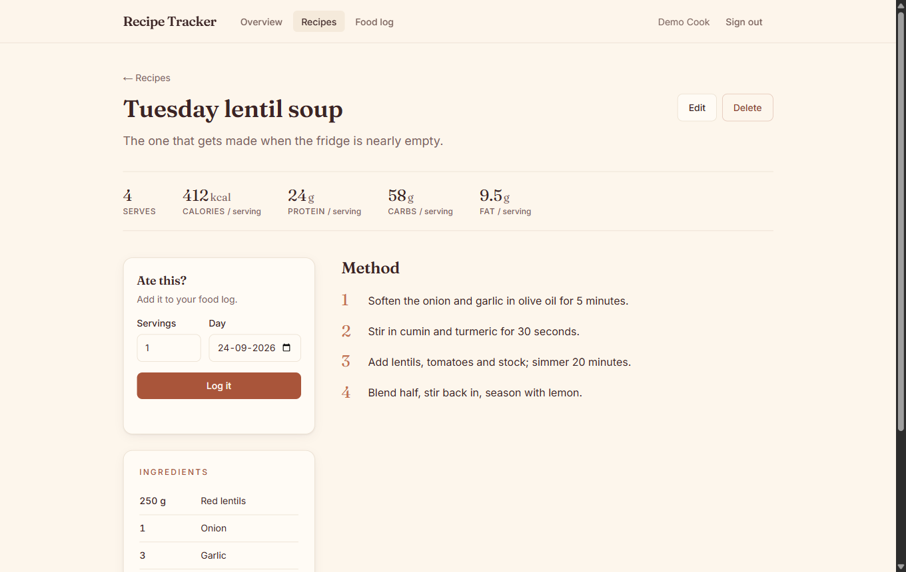
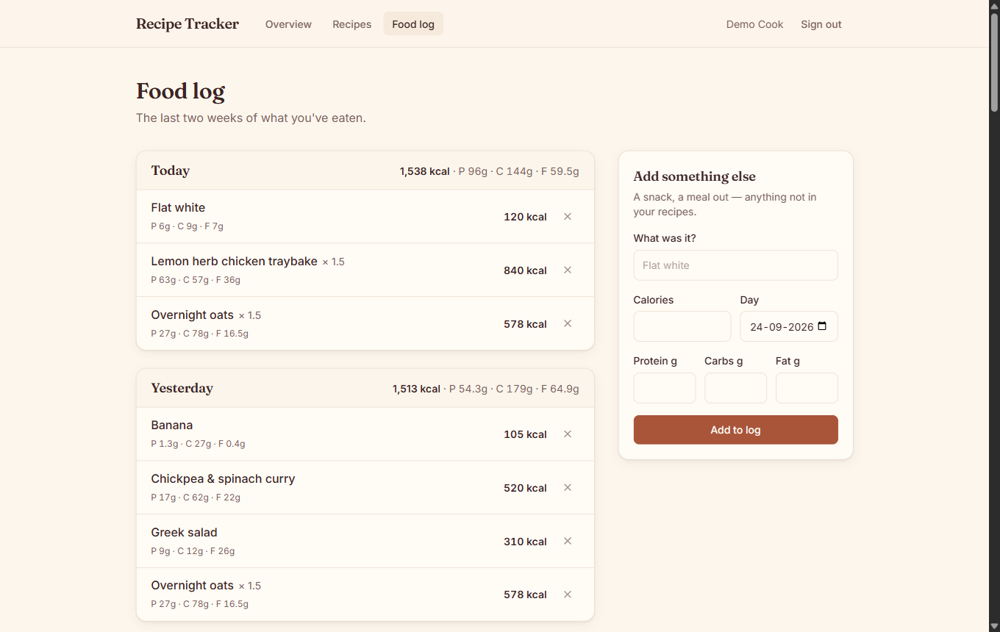
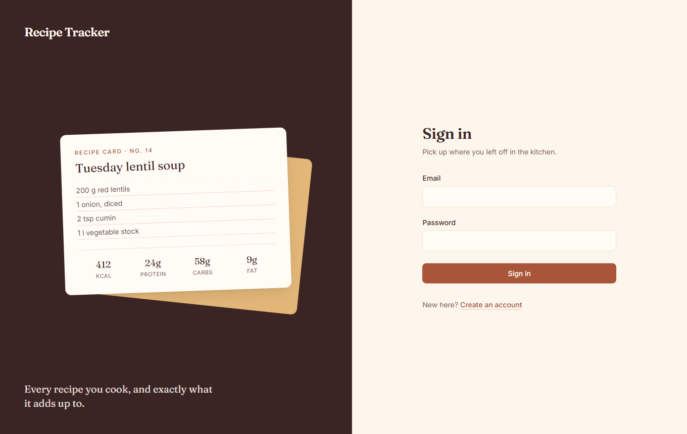

# Recipe Tracker

Save the recipes you actually cook, log what you eat, and see what your week adds up to.



**Stack:** Next.js 16 (App Router) · React 19 · PostgreSQL · Prisma 6 · Better Auth · Zod 4 · Tailwind CSS 4 · Vitest · GitHub Actions

## What it does

- **Recipe box** — create, edit and delete recipes with a structured ingredient list, a numbered method and per-serving nutrition. Search matches titles _and_ ingredients.
- **Food log** — log a recipe in one tap (any number of servings, any day) or add a one-off item by hand. History is grouped by day with daily totals.
- **Overview** — today's calories against an optional daily goal, macros, a 7-day calorie chart, and your most-logged recipes.
- **Accounts** — email/password auth with rate-limited sign-in, per-user data isolation on every query.

| Recipe                                 | Food log                              | Sign in                                |
| -------------------------------------- | ------------------------------------- | -------------------------------------- |
|  |  |  |

## Architecture

```
Browser ──► proxy.js (cookie present? else → /login?next=…)
        │
        ├─► Server Components (pages) ──┐
        │                               ├─► src/lib/*  (data access, scoped by userId) ──► Prisma ──► Postgres
        └─► Route Handlers (/api/*) ────┘        ▲
               ▲                                 │
               └── Client Components (forms) — validate with the same Zod schemas the API uses
```

- **Reads** happen in Server Components, which call the data-access functions in `src/lib` directly. Pages never `fetch` their own API.
- **Writes** go through REST route handlers (`/api/recipes`, `/api/logs`, `/api/me`) so the same contract serves the UI and any future client.
- **One validation source.** `src/lib/validations/*` holds Zod schemas used by both the client forms (instant feedback) and the route handlers (the real check).

```
src/
├── app/
│   ├── (auth)/          login, register — shared split-screen layout
│   ├── (app)/           signed-in area — shared header, auth check, loading/error states
│   └── api/             REST route handlers
├── components/          ui/ primitives, recipes/, log/, dashboard/
├── lib/                 data access (recipes.js, logs.js), auth, session, validation, date helpers
└── proxy.js             optimistic route protection (Next 16's renamed middleware)
tests/
├── unit/                schemas, date math, open-redirect guard
└── integration/         route handlers against a real Postgres
```

### API

| Method | Path               | Notes                                                                       |
| ------ | ------------------ | --------------------------------------------------------------------------- |
| GET    | `/api/recipes`     | `?q=&page=` — search title or ingredient, 12 per page                       |
| POST   | `/api/recipes`     | `201` · `400` with `fieldErrors`                                            |
| GET    | `/api/recipes/:id` | `404` if missing _or owned by someone else_                                 |
| PUT    | `/api/recipes/:id` | Full replacement (hence PUT, not PATCH)                                     |
| DELETE | `/api/recipes/:id` | `204`; past log entries survive as snapshots                                |
| GET    | `/api/logs`        | `?from=&to=` (YYYY-MM-DD), defaults to the last 7 days                      |
| POST   | `/api/logs`        | `{ source: "recipe" \| "manual", … }` · `422` if the recipe has no calories |
| DELETE | `/api/logs/:id`    | `204` / `404`                                                               |
| PATCH  | `/api/me`          | `{ calorieGoal: number \| null }`                                           |

Every endpoint returns `401` without a session.

## Design decisions

**Log entries are snapshots.** A `NutritionLog` row copies the recipe's name and macros at the moment it's logged. Editing a recipe's calories next week must not rewrite what you ate last week, and deleting a recipe sets `recipeId` to null (`onDelete: SetNull`) rather than erasing history.

**"Today" is the user's today.** A log belongs to a calendar day (`DATE` column) chosen by the user's browser, not a UTC timestamp. The browser reports its timezone in a cookie, so the server can answer "what did I eat today" correctly for someone in India at 1 a.m. UTC. Date arithmetic is done in UTC on `YYYY-MM-DD` strings so DST never shifts a day.

**Ingredients are a shared, normalised catalogue.** `Ingredient` is unique by lower-cased name and joined through `RecipeIngredient` (quantity, unit, order). Inserts use `createMany({ skipDuplicates })` (`ON CONFLICT DO NOTHING`), so two users adding "garlic" at the same instant can't collide, and a recipe save is two ingredient queries, not one per row. Create/update run in a single transaction.

**Authorisation lives in the data layer.** Every query in `src/lib/recipes.js` and `src/lib/logs.js` filters by `userId`. Someone else's recipe returns `404`, not `403`, so ids can't be probed for existence.

**Two auth checks, on purpose.** `proxy.js` only checks that a session cookie exists (cheap, runs on every request, no database). The real check is `requireUser()` in the signed-in layout, which validates the session. The proxy deliberately doesn't bounce logged-in users away from `/login`: with a stale cookie that creates a redirect loop, so that check uses the real session instead.

**Favourites are derived, not maintained.** "Your regulars" are the recipes you logged most in the last 30 days — a `groupBy` over the log instead of a star button the user has to keep up to date.

**Security basics.** Rate-limited sign-in/sign-up (counters stored in Postgres, so the limit holds across multiple instances), a same-origin check on the post-login `?next=` redirect (rejects `//evil.com` and `/\evil.com`), baseline security headers, and no raw error messages sent to the client.

**Visual identity.** A warm "recipe card" look — cream paper, deep-brown ink, terracotta accents, Fraunces for headings and Inter for text — chosen to feel like a kitchen notebook rather than a SaaS template. Colours are Tailwind v4 theme tokens; button text colours were picked to clear WCAG AA contrast. Lighthouse: 100 accessibility, 100 best practices.

### Known limits (and what I'd do next)

- Recipe search uses `ILIKE '%term%'`, which scans a user's recipes. Fine at hundreds per user; a `pg_trgm` GIN index would be the next step.
- Sign-up tells you when an email is already registered. The auth API reveals this anyway, so hiding it in the form would only frustrate real users; stopping email probing properly needs verification emails, plus a password-reset flow.
- The timezone comes from a cookie. If the app ever sends reminders from the server, it should be stored on the user.
- No image upload yet — it's planned alongside deployment (S3 with presigned uploads).
- No Content-Security-Policy yet: Next's inline scripts need per-request nonces, which I'll add with deployment.

## Running it locally

Requires Node 22+ and a Postgres database (a free [Neon](https://neon.tech) project works).

```bash
npm install
cp .env.example .env          # fill in DATABASE_URL, TEST_DATABASE_URL, BETTER_AUTH_SECRET
npx prisma migrate deploy
npm run dev                    # http://localhost:3000
npm run seed:demo              # optional: demo account with recipes + two weeks of log
```

## Tests

```bash
npm run test:unit              # fast, no database
npm run test:integration       # route handlers against TEST_DATABASE_URL
npm test                       # both
```

Integration tests call the real route handlers against a real Postgres. Only "who is signed in" is mocked. They cover authentication (401s), cross-user isolation (404s), validation (400s), snapshot semantics and the macro maths. The setup refuses to run if `TEST_DATABASE_URL` equals `DATABASE_URL`, and it only ever `TRUNCATE`s tables in the test schema — never `DROP`.

CI (`.github/workflows/ci.yml`) runs formatting, lint, migrations on an empty database, all tests against a Postgres service container, and a production build on every push and pull request.
